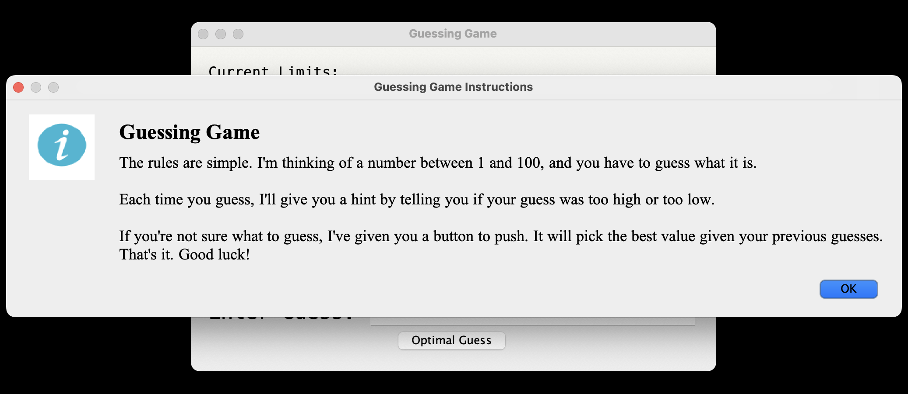
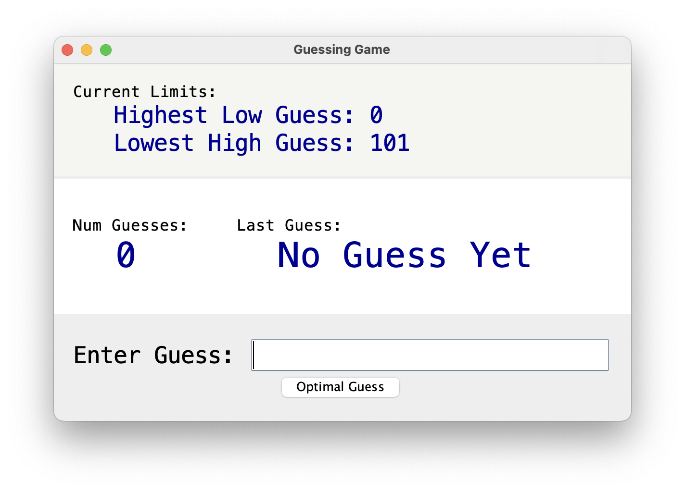
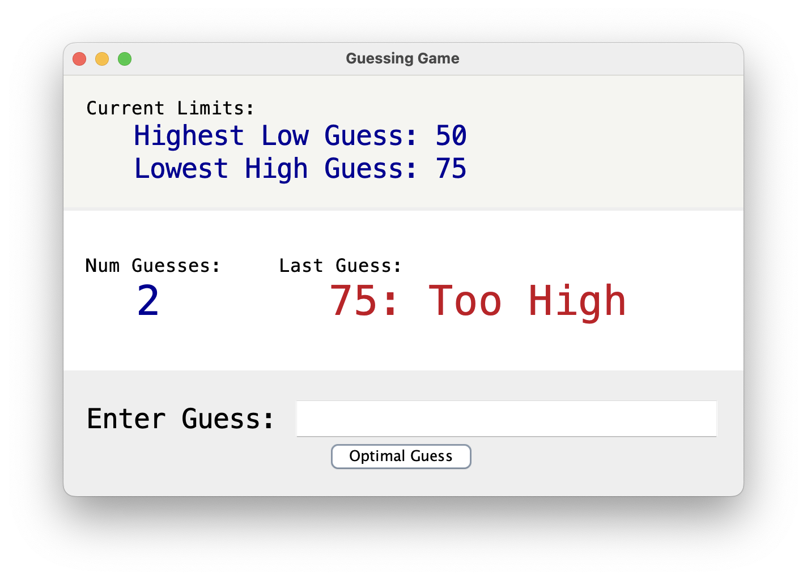
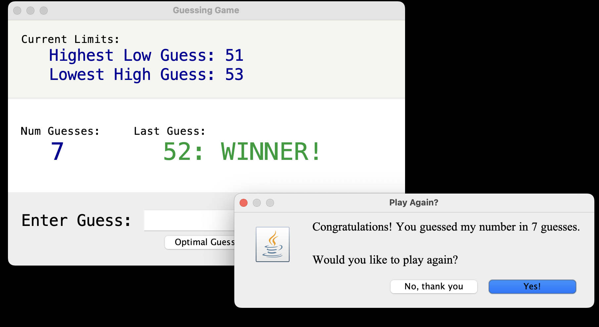

## P4 Guessing Game

### Introduction

For Project 4, you will write a GUI based java program that implements a simple guessing game. The logic of the game is straightforward. The game will select a random integer between 1 and 100. Each turn, the user will try to guess the number. If the user guesses correctly, the game will end. If not, the game will give the user a hint by stating whether the guess was too high or too low. The game will keep track of the number of guesses the user makes, and include this information when the game ends. When the game ends, the user will be prompted if they want to play again and the game will restart if they say yes.

### GUI Requirements

The primary purpose of the assignment is to explore the components of GUI programming in Java. As such, most of the requirements will be related to how the information is displayed on the screen.

#### Program Start

When the program starts, a window will be displayed showing instructions for how to play the game. This window should be dismissed by pressing a button marked "OK" or similar. Note: the easier approach to problem is to use the JOptionPane's *showMessageDialog(...)* method. This is not required, of course, and students are encourage to explore different options.

For full credit, the instructions should appear over top of the main game playing area as shown in the following screencap:



#### Main Board

The main playing area will display current information about the game, as well as provide two different means for entering a guess.

*Guess Limits*

The game should display the highest incorrect guess that was too low, as well as the lowest incorrect guess that was too high. This information should appear at the top of the window and be labeled as "Current Limits." The actual limits should be labeled and displayed one above the other with the highest low guess on top. The actual values should be arranged so that the values align with each other horizontally. The labels and values should be of a larger font size than the "Current Limits" label. See the screen cap of the playing area below for an example.

When the game begins, of course, there will be no values for these limits. There should still be a display of labels, but the initial value is left up to the student. The example below displays artificial limits of 0 and 101 to start the game, but "N/A" or just leaving the space blank are also reasonable options.

*Current State*

The middle of the game board will display the number of guesses the user has made so far, and the most recent guess that they made. Each of these values will have a label above the actual value. The number of guesses label and value should appear to the left of the last guess label and value. The font size for the labels should match the label for the limits described above. However, the font size for the values should be larger than the limit values. Note that this description can be achieved by thinking of a small, medium, and large font size.

Again, when the game first starts there will be no guesses yet. The number of guesses should be displayed as 0. The last guess should show the text "No Guess Yet". This text should be any color other than red or green.

*User Input*

The bottom of the board will provide a text box for the user to enter their guess. It should be labeled appropriately and input box should be large enough to look proportional on the screen. In terms of previous requirements, the text should be at least as big as your medium font. 

Below the input box should be a button labeled "Optimal Guess." The button should not span the entire width of the window, but should be big enough to contain its text.

Below is a screen cap of an example of the initial state of the game board:



#### GUI Functionality

When the user enters a guess in the input box and presses <ENTER> (or <Return> depending on your keyboard), the input box will be cleared and the guess will be read by the game and processed. If the user enters anything other than an integer in the accepted range (1 to 100), the guess will be ignored and the display will not change.

If the user's guess is incorrect, the value of the last guess should be updated to the correct value and the color of the text should be changed to red. The last guess text should also include the hint of too high or too low.

If the user's guess is correct, the value of the last guess should be updated to the correct value but the text should appear green in color.

After every valid guess, all displayed values should be updated accordingly. That is, the limits should be checked and updated, and the number of guesses should be updated.

If the user presses the "Optimal Guess" button, the game will automatically select the next guess as halfway between the highest low guess and the lowest high guess. This should be treated as a valid guess, updating the limits, the number of guesses, and the last guess as described above.

The following shows and example board after an incorrect guess:



If the user guesses correctly, either through the text input or the button, the game will end. A new window should appear that informs the user that they have won and shows the number of guesses it took. See the following screen cap of the end of the game:



It should also ask them to play again. If the user selects indicates they want to play again, then the board should return to initial state, with all colors and values as described above, and the game should start over with a new secret number.

Note that the play again window may appear above the game board in such a way that the green winner text is not visible. It should still be possible to move to the window manually to see the correct display.

*Final note on GUI requirements*

While I have provided screenshots of my solution to the project in the write-up, you do not have to match my design precisely. In fact, I would prefer that you **not** do so. You need to display the information specified above, and match the explicit requirements (e.g., red text for incorrect guesses), but you should explore your own design ideas and implement a solution that is unique.

### Java Structure Requirements

You are provided with minimal starter code for your P4. The organization of your files and packages is up to you as long as everything exists within the ```edu.wm.cs.cs220.guess``` package structure that has been initialized for you.

### Project Structure Requirements

Your project should maintain the Gradle build system that was initialized and included in the starter code. The build system has not been modified from its initial configuration. You should include instructions for clean, build, and execution of your program in the README.md file.

### Git Requirements

You must make a minimum of 10 commits with good, succinct, commit messages. You should have at least one working version tagged with a version number. Start by tagging your final version as v4.0 (for P4), but feel free to make changes and add tags as necessary.

### Code Style Requirements
Code should be well organized and efficient where possible. Good variable names, good method names, and modularity to enable small, easy to read submissions are expected.
